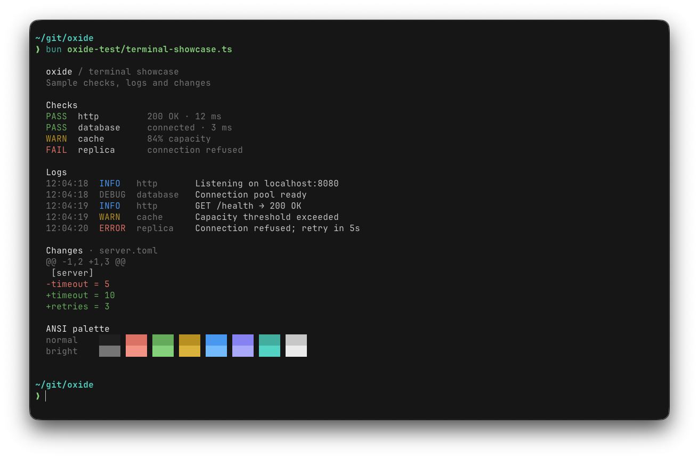

<div align="center">

# oxide for alacritty

</div>

<h6 align="center">
Where function meets form.
</h6>

<p align="center">
  <a href="https://github.com/oxidescheme/alacritty/stargazers"></a>
  <a href="https://github.com/oxidescheme/alacritty/issues"></a>
  <a href="https://discord.gg/p8GcbBH5MR"></a>
</p>

<p align="center">
  
</p>

oxide colorscheme for [alacritty](https://alacritty.org/).

## Installation

1. Download `oxide.toml` from this repository
2. Copy it next to your alacritty config: `~/.config/alacritty/`
3. Import it in your `alacritty.toml`:

```toml
import = [
  "~/.config/alacritty/oxide.toml"
]
```

## Contributing

PRs welcome. Make sure colors match the palette in the [main repo](https://github.com/oxidescheme/oxide).

## Credits

- **Port Creator:** [@jakmaz](https://github.com/jakmaz)
- **Current Maintainer:** [@jakmaz](https://github.com/jakmaz)
- **Contributors:** See [contributors list](https://github.com/oxidescheme/alacritty/graphs/contributors)

## License

MIT License - see [LICENSE](LICENSE) for details.

<p align="center">
Copyright &copy; 2026-present oxidescheme
</p>
